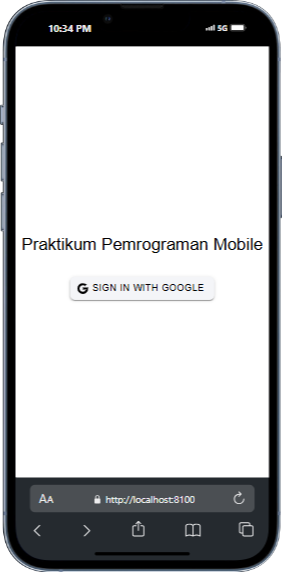

# TugasMobile9_AbdulAziz_ShiftE
 
# Tugas 9 Pertemuan 10 - Proyek Ionic

**Nama:** Abdul Aziz Fahmi 'Alauddin  
**NIM:** H1D022040  
**Shift Baru:** E  

# Inisialisasi Firebase `firebase.ts`

1. Konfigurasi Firebase: Menghubungkan aplikasi dengan proyek Firebase menggunakan `firebaseConfig`.

2. Inisialisasi Authentication: Menginisialisasi layanan autentikasi Firebase menggunakan `getAuth`.

3. Provider GoogleAuth: Membuat instance dari `GoogleAuthProvider` untuk memungkinkan autentikasi dengan akun Google.

# Autentikasi `auth.ts`

1. Variabel `user`: Menyimpan informasi pengguna yang login.

2. Computed Property `isAuth`: Mengecek apakah pengguna sudah login atau belum (bernilai true jika user tidak kosong).

3. Fungsi `loginWithGoogle`: Mengatur proses login dengan Google. Langkah-langkahnya:

- Inisialisasi GoogleAuth: Menggunakan plugin @codetrix-studio/capacitor-google-auth untuk autentikasi Google di perangkat seluler.
- Proses Sign-In: Melakukan autentikasi Google dengan memanggil GoogleAuth.signIn(), yang mengembalikan ID token pengguna.
- Konversi Token ke Credential: Menggunakan GoogleAuthProvider.credential(idToken) untuk membuat kredensial Firebase dari ID token.
- Autentikasi Firebase: Menggunakan signInWithCredential untuk login ke Firebase dengan kredensial Google.
- Penyimpanan Data Pengguna: Menyimpan data pengguna ke variabel user dan mengarahkan pengguna ke halaman /home.
- Error Handling: Menampilkan alert jika login gagal.

4. Fungsi logout: Melakukan logout dengan memanggil signOut dari Firebase dan GoogleAuth.signOut(), lalu menghapus data pengguna dan mengarahkan ke halaman login.

5. Status Autentikasi dengan onAuthStateChanged: Firebase mendeteksi perubahan status login pengguna dan memperbarui variabel user setiap kali ada perubahan.

# Autentikasi `router/index.ts`

1. Akses Halaman Terproteksi: Setelah login, pengguna dapat mengakses halaman seperti /home dan /profile.

2. Konfigurasi Rute: Menyusun rute untuk login (/login)

3. konfigurasi beranda (/home)

4. konfigurasi profil (/profile).