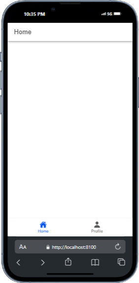
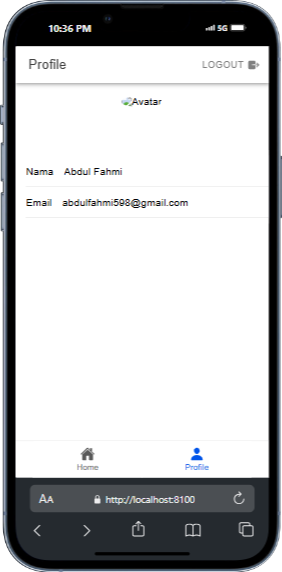

# TugasMobile9_AbdulAziz_ShiftE
 
# Tugas 9 Pertemuan 10 - Proyek Ionic

**Nama:** Abdul Aziz Fahmi 'Alauddin  
**NIM:** H1D022040  
**Shift Baru:** E  

# Inisialisasi Firebase `firebase.ts`

1. Konfigurasi Firebase: Menghubungkan aplikasi dengan proyek Firebase menggunakan `firebaseConfig`.

2. Inisialisasi Authentication: Menginisialisasi layanan autentikasi Firebase menggunakan `getAuth`.

3. Provider GoogleAuth: Membuat instance dari `GoogleAuthProvider` untuk memungkinkan autentikasi dengan akun Google.


# Autentikasi `auth.ts`


1. Variabel `user`: Menyimpan informasi pengguna yang login.

2. Computed Property `isAuth`: Mengecek apakah pengguna sudah login atau belum (bernilai true jika user tidak kosong).


3. Fungsi `loginWithGoogle`: Mengatur proses login dengan Google. Langkah-langkahnya:

- Inisialisasi GoogleAuth: Menggunakan plugin @codetrix-studio/capacitor-google-auth untuk autentikasi Google di perangkat seluler.
- Proses Sign-In: Melakukan autentikasi Google dengan memanggil GoogleAuth.signIn(), yang mengembalikan ID token pengguna.
- Konversi Token ke Credential: Menggunakan GoogleAuthProvider.credential(idToken) untuk membuat kredensial Firebase dari ID token.
- Autentikasi Firebase: Menggunakan signInWithCredential untuk login ke Firebase dengan kredensial Google.
- Penyimpanan Data Pengguna: Menyimpan data pengguna ke variabel user dan mengarahkan pengguna ke halaman /home.
- Error Handling: Menampilkan alert jika login gagal.


4. Fungsi logout: Melakukan logout dengan memanggil signOut dari Firebase dan GoogleAuth.signOut(), lalu menghapus data pengguna dan mengarahkan ke halaman login.

5. Status Autentikasi dengan onAuthStateChanged: Firebase mendeteksi perubahan status login pengguna dan memperbarui variabel user setiap kali ada perubahan.

# Autentikasi `router/index.ts`

1. Akses Halaman Terproteksi: Setelah login, pengguna dapat mengakses halaman seperti /home dan /profile.

2. Konfigurasi Rute: Menyusun rute untuk login (/login)



3. konfigurasi beranda (/home)



4. konfigurasi profil (/profile).

### Screenshot

Berikut adalah screenshot dari aplikasi yang telah selesai:


## Penjelasan Proses CRUD ke Firebase

Aplikasi ini menggunakan Firebase Firestore sebagai backend untuk menyimpan data Todo. 

1. Struktur Data Todo

Data Todo memiliki struktur sebagai berikut:
```typescript
export interface Todo {
    id?: string;
    title: string;
    description: string;
    status: boolean;
    createdAt: Timestamp;
    updatedAt: Timestamp;
}
```

2. Mengambil Referensi Koleksi Todo

Setiap operasi CRUD dimulai dengan mendapatkan referensi ke koleksi Todo di Firestore:
```typescript
    getTodoRef() {
    const uid = auth.currentUser?.uid;
    if (!uid) throw new Error('User not authenticated');
    return collection(db, 'users', uid, 'todos');
}
```

Referensi ini digunakan untuk mengakses dokumen Todo milik pengguna yang sedang login.

3. Operasi Create


Untuk menambahkan Todo baru, aplikasi memanggil addTodo:
```typescript
async addTodo(todo: Omit<Todo, 'id'>) {
    const todoRef = this.getTodoRef();
    const docRef = await addDoc(todoRef, {
        ...todo,
        status: false,
        createdAt: Timestamp.now(),
        updatedAt: Timestamp.now()
    });
    return docRef.id;
}
```

Data Todo dikirim ke Firestore dengan menambahkan dokumen baru ke koleksi.

4. Operasi Read


Untuk membaca semua Todo, aplikasi memanggil getTodos:
```typescript
async getTodos(): Promise<Todo[]> {
    const todoRef = this.getTodoRef();
    const q = query(todoRef, orderBy('updatedAt', 'desc'));
    const snapshot = await getDocs(q);
    return snapshot.docs.map((doc) => ({
        id: doc.id,
        ...doc.data()
    } as Todo));
}
```

Data Todo diambil dari Firestore dan diurutkan berdasarkan updatedAt.

5. Operasi Update


Untuk memperbarui Todo, aplikasi memanggil updateTodo:
```typescript
async updateTodo(id: string, todo: Partial<Todo>) {
    const todoRef = this.getTodoRef();
    const docRef = doc(todoRef, id);
    await updateDoc(docRef, {
        ...todo,
        updatedAt: Timestamp.now()
    });
}
```

Dokumen Todo yang ada diperbarui dengan data baru.

6. Operasi Delete

before


after


Untuk menghapus Todo, aplikasi memanggil deleteTodo:
```typescript
async deleteTodo(id: string) {
    const todoRef = this.getTodoRef();
    const docRef = doc(todoRef, id);
    await deleteDoc(docRef);
}
```

Dokumen Todo dihapus dari koleksi.

7. Integrasi dengan Komponen Vue

Komponen InputModal.vue digunakan untuk menambah atau mengedit Todo. Data yang diinput oleh pengguna dikirim ke Firestore melalui event submit:
```typescript
const input = () => {
    emit('submit', localTodo.value);
    cancel();
}
```
Komponen `HomePage.vue` menampilkan daftar Todo dan menangani operasi CRUD:

- `loadTodos` memuat data Todo dari Firestore.
- `handleSubmit` menangani penambahan atau pengeditan Todo.
- `handleDelete` menangani penghapusan Todo.
- `handleStatus` menangani perubahan status Todo.

*** asset lengkap screenshot ada di folder img

### Penjelasan Logic CRUD

1. Create (Menambahkan Todo)
- InputModal.vue: Pengguna memasukkan data Todo melalui modal input.
- handleSubmit di HomePage.vue: Fungsi ini dipanggil saat pengguna menekan tombol submit pada modal. Fungsi ini memanggil addTodo dari firestoreService.
- firestoreService.addTodo di firestore.ts: Fungsi ini menambahkan Todo baru ke Firestore dengan menggunakan addDoc.

2. Read (Membaca Todo)
- loadTodos di HomePage.vue: Fungsi ini dipanggil saat halaman dimuat dan saat pengguna melakukan refresh Fungsi ini memanggil getTodos dari firestoreService.
- firestoreService.getTodos di firestore.ts: Fungsi ini mengambil semua Todo dari Firestore dengan menggunakan getDocs dan mengurutkannya berdasarkan updatedAt.

3. Update (Mengedit Todo)
- handleEdit di HomePage.vue: Fungsi ini dipanggil saat pengguna menekan tombol edit pada Todo. Fungsi ini membuka modal input dengan data Todo yang akan diedit.
- handleSubmit di HomePage.vue: Fungsi ini juga menangani pengeditan Todo. Jika editingId tidak null, fungsi ini memanggil updateTodo dari firestoreService.
- firestoreService.updateTodo di firestore.ts: Fungsi ini memperbarui Todo di Firestore dengan menggunakan updateDoc.

4. Delete (Menghapus Todo)
- handleDelete di HomePage.vue: Fungsi ini dipanggil saat pengguna menekan tombol delete pada Todo. Fungsi ini memanggil deleteTodo dari firestoreService.
- firestoreService.deleteTodo di firestore.ts: Fungsi ini menghapus Todo dari Firestore dengan menggunakan deleteDoc.

5. Update Status (Mengubah Status Todo)
- handleStatus di HomePage.vue: Fungsi ini dipanggil saat pengguna menekan tombol untuk mengubah status Todo. Fungsi ini memanggil updateStatus dari firestoreService.
- firestoreService.updateStatus di firestore.ts: Fungsi ini memperbarui status Todo di Firestore dengan menggunakan updateDoc.

### Flow CRUD
- Pengguna menambahkan/mengedit Todo: Data Todo dikirim ke Firestore melalui firestoreService.
- Pengguna membaca Todo: Data Todo diambil dari Firestore dan ditampilkan di aplikasi.
- Pengguna menghapus Todo: Todo dihapus dari Firestore melalui firestoreService.
- Pengguna mengubah status Todo: Status Todo diperbarui di Firestore melalui firestoreService.

#### Build APK


Langkah-Langkah:
1. Masuk ke Direktori Proyek
Pindah ke direktori proyek Ionic Anda:

cd path/to/your/ionic-project

2. Pastikan Proyek Siap Dibangun
Jalankan perintah berikut untuk memastikan proyek dapat dibangun:

ionic build --prod

3. Tambahkan Platform Android (Jika Belum Ada)
Jika platform Android belum ditambahkan, tambahkan dengan perintah:

ionic capacitor add android

npx cap sync android

4. Buka Proyek di Android Studio
Buka proyek Android Anda dengan Android Studio:

npx cap open android

5. Build APK di Android Studio
Setelah proyek terbuka di Android Studio:

Pilih menu Build > Build Bundle(s)/APK(s) > Build APK(s).
Tunggu hingga proses selesai.
APK hasil build akan berada di direktori:
android/app/build/outputs/apk/
